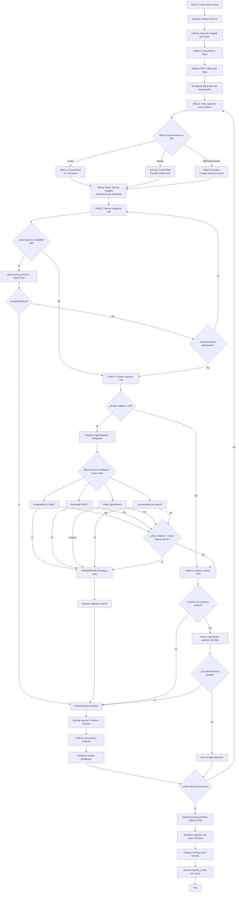
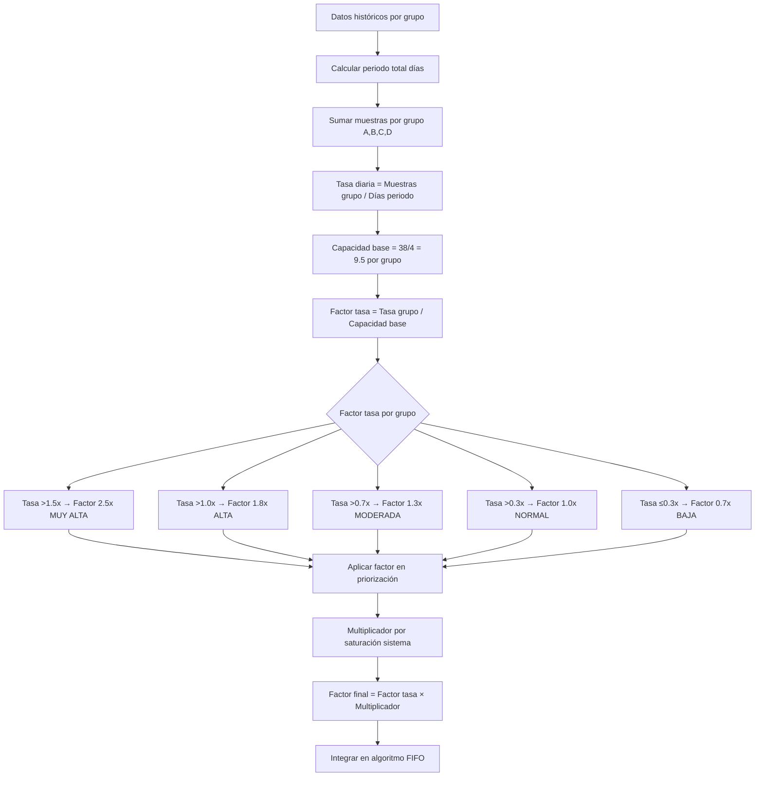
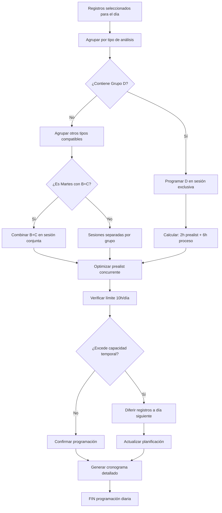

# DOCUMENTACIÓN TÉCNICA ACTUALIZADA
## Sistema de Planeación de Laboratorio con Optimización Heurística

### 📋 RESUMEN EJECUTIVO
Sistema de planeación inteligente para laboratorio de análisis de caña, implementando:
- **Algoritmo heurístico optimizado** con restricciones operativas reales
- **Capacidad diaria**: 38 muestras/día con umbral mínimo del 75% (29 muestras)
- **Restricciones semanales** por disponibilidad de personal especializado
- **Fragmentación inteligente** para registros grandes (>38 muestras)
- **Priorización FIFO** con criterios de urgencia (20 días)
- **Entrega completa** de registros (todos los grupos A, B, C, D)

---

## 🎯 HEURÍSTICA OPTIMIZADA ACTUALIZADA

### **Algoritmo Principal: `plan_week_by_day()`**

#### **Fase 1: Inicialización y Preparación**
```
1. Cargar datos de Excel (Prueba, Tiempo, Capacidad)
2. Expandir análisis por tipo (A, B, C, D)
3. Ordenar por FIFO: Fecha solicitud + Registro
4. Configurar capacidad diaria = 38 muestras
5. Definir umbral mínimo = 75% = 29 muestras/día
6. Inicializar días laborales: Lunes-Jueves
```

#### **Fase 2: Procesamiento Diario (Lunes-Jueves)**

##### **2.1 Aplicación de Restricciones Operativas**
```
DÍA DE LA SEMANA → GRUPOS PERMITIDOS:
├── LUNES: Solo A y D (D NUNCA se combina)
├── MARTES: Solo B y C (SÍ se pueden combinar)
└── MIÉRCOLES/JUEVES: Todos los grupos (A, B, C, D)

REGLA CRÍTICA: Grupo D es EXCLUSIVO
- Si se programa D → Solo D en esa sesión
- D solo puede ir con A los lunes (procesamiento separado)
```

##### **2.2 Selección de Registros por Prioridad**
```
PRIORIZACIÓN FIFO + URGENCIA + TASAS DE LLEGADA DIRECTAS:
1. Antiguedad ≥ 20 días → MÁXIMA PRIORIDAD
2. Tasa de llegada vs capacidad base del grupo → PRIORIDAD POR DEMANDA
3. Fecha solicitud más antigua (FIFO mejorado con boost de tasa)
4. Factor multiplicador por saturación del sistema
5. Número de registro (criterio secundario)
6. Disponibilidad según día de la semana
```

##### **2.3 Optimización de Capacidad**

###### **Categorización por Tamaño:**
```
REGISTROS PEQUEÑOS (≤38 muestras):
├── NUNCA fragmentar
├── Procesar completo o no procesar
└── Prioridad para llenar capacidad

REGISTROS GRANDES (>38 muestras):
├── Evaluar fragmentación inteligente
├── Aplicar criterios de decisión múltiples
└── Respetar umbral del 75%
```

###### **Estrategia de Llenado:**
```
PASO 1: Registros completos ≤38 muestras
├── Buscar combinaciones que maximicen uso
├── Respetar restricciones diarias
└── Priorizar por FIFO

PASO 2: Evaluación inteligente >38 muestras
├── Solo si no se completó capacidad en Paso 1
├── Aplicar criterios de fragmentación
└── Verificar beneficio vs. resto

PASO 3: Alcanzar umbral mínimo 75%
├── Si aún falta para 29 muestras
├── Permitir fragmentos más flexibles
└── Registros urgentes (≥10 días)
```

#### **Fase 3: Fragmentación Inteligente**

##### **Criterios de Decisión Múltiples:**
```
EVALUACIÓN DE FRAGMENTACIÓN (registros >38):

1. ANTIGÜEDAD DE MUESTRA:
   ├── ≥15 días → FRAGMENTAR (urgente)
   └── <15 días → Evaluar otros criterios

2. PORCENTAJE PROCESABLE:
   ├── ≥60% del registro → FRAGMENTAR (eficiente)
   └── <60% → Solo si otros criterios lo justifican

3. RESTO SIGNIFICATIVO:
   ├── Resto ≥38 muestras → Puede fragmentar
   └── Resto <38 muestras → Mejor completar

4. ESPACIO DISPONIBLE:
   ├── ≥76 muestras libres → Permitir fragmento grande
   └── <76 muestras → Fragmento conservador

5. UMBRAL DEL 75%:
   ├── Si ayuda a alcanzar 29 muestras → FRAGMENTAR
   └── Si no aporta significativamente → Evaluar

DECISIÓN FINAL:
fragmentar = (antigüedad ≥ 15 días) OR
            (porcentaje ≥ 60%) OR
            (espacio ≥ 76 AND resto ≥ 38) OR
            (resto < 38) OR
            (necesita_umbral AND ayuda_alcanzar)
```

#### **Fase 4: Verificación de Entrega Completa**

```
CONTROL DE REGISTROS COMPLETOS:
1. Verificar todos los grupos requeridos por registro
2. Un registro se ENTREGA solo cuando A+B+C+D están listos
3. Calcular progreso acumulado por registro
4. Mostrar estado: Pendiente/En Proceso/Completo
```

#### **Fase 5: Programación Temporal**

```
SESIONES DE TRABAJO:
├── Prealistamiento: 2 horas por grupo
├── Procesamiento: 6 horas por grupo
└── Horario: 8:00 AM - 6:00 PM (10 horas/día)

CONCURRENCIA:
├── Prealistamiento y Procesamiento simultáneos
├── Diferentes grupos pueden prealistarse mientras otros procesan
└── Optimización de tiempos muertos
```

---

## 📊 CRITERIOS DE PRIORIZACIÓN

### **Criterios Primarios:**
1. **Urgencia por Antigüedad**
   - ≥20 días: Prioridad máxima automática
   - 15-19 días: Prioridad alta
   - 10-14 días: Prioridad media
   - <10 días: Prioridad normal

2. **Criterio de Tasa de Llegada Directa**
   - Tasa >1.5x capacidad base: Factor 2.5x (DEMANDA MUY ALTA)
   - Tasa >1.0x capacidad base: Factor 1.8x (DEMANDA ALTA)
   - Tasa >0.7x capacidad base: Factor 1.3x (DEMANDA MODERADA)
   - Tasa >0.3x capacidad base: Factor 1.0x (DEMANDA NORMAL)
   - Tasa ≤0.3x capacidad base: Factor 0.7x (DEMANDA BAJA)

3. **Orden FIFO Estricto**
   - Fecha de solicitud (ascendente)
   - Número de registro (criterio de desempate)

4. **Disponibilidad Operativa**
   - Restricciones por día de la semana
   - Disponibilidad de personal especializado
   - Compatibilidad entre grupos

### **Criterios Secundarios:**
1. **Eficiencia de Capacidad**
   - Maximizar uso de 38 muestras/día
   - Evitar capacidades <75% (29 muestras)
   - Minimizar tiempos muertos

2. **Completitud de Registros**
   - Priorizar registros cerca de completarse
   - Balancear grupos pendientes por registro
   - Optimizar entregas semanales

---

## ⚙️ CRITERIOS DE PROGRAMACIÓN

### **Restricciones Operativas Hard:**
1. **Capacidad Diaria Máxima**: 38 muestras/día
2. **Umbral Mínimo**: 29 muestras/día (75%)
3. **Días Laborales**: Lunes-Jueves únicamente
4. **Horario**: 8:00 AM - 6:00 PM (10 horas)

### **Restricciones por Disponibilidad de Personal:**
```
LUNES:
├── Personal A disponible
├── Personal D disponible
└── Grupos B y C NO disponibles

MARTES:
├── Personal B disponible
├── Personal C disponible
└── Grupos A y D NO disponibles

MIÉRCOLES:
├── Todo el personal disponible
└── Todos los grupos permitidos

JUEVES:
├── Todo el personal disponible
└── Todos los grupos permitidos
```

### **Reglas de Compatibilidad:**
1. **Grupo D = EXCLUSIVO SIEMPRE**
   - Nunca se combina con A, B, o C
   - Requiere sesión dedicada
   - Excepción: Lunes puede tener A y D en sesiones separadas

2. **Combinaciones Permitidas:**
   - Martes: B+C (procesamiento conjunto optimizado)
   - Miércoles/Jueves: A+B+C (D siempre separado)

3. **Tiempos de Procesamiento:**
   - Prealistamiento: 2h por grupo
   - Procesamiento: 6h por grupo
   - Máximo concurrente: 2 grupos diferentes (prealist. + proceso)

### **Criterios de Optimización:**
1. **Maximización de Throughput**
   - Llenar capacidad diaria completa (38 muestras)
   - Minimizar días con <75% utilización
   - Balancear carga entre días

2. **Fragmentación Inteligente**
   - Solo para registros >38 muestras
   - Evaluación multi-criterio antes de fragmentar
   - Preferir completar registros pequeños

3. **Programación Temporal**
   - Concurrencia prealistamiento/procesamiento
   - Optimizar transiciones entre grupos
   - Minimizar setup times

---

## � ANÁLISIS DE TASAS DE LLEGADA

### **Fundamento Teórico:**
El sistema calcula tasas de llegada históricas por grupo para optimizar la predicción de demanda y asignación de capacidad:

**Fórmula Base:**
```
Tasa de Llegada (Grupo G) = Total muestras del grupo G / Total días en el periodo
```

### **Métricas Calculadas por Grupo:**

#### **Métricas Básicas:**
- **Tasa diaria**: Muestras/día promedio del grupo
- **Total muestras**: Suma histórica de muestras del grupo
- **Días analizados**: Periodo total de datos disponibles
- **Número de registros**: Cantidad de solicitudes del grupo
- **Promedio por registro**: Muestras promedio por solicitud

#### **Métricas de Capacidad:**
- **Porcentaje de demanda**: % que representa del total de muestras
- **Capacidad proporcional**: Capacidad sugerida según demanda histórica
- **Tiempo de espera**: Días estimados de acumulación
- **Factor de saturación**: Ratio demanda/capacidad proporcional
- **Prioridad de capacidad**: Clasificación (CRÍTICA/ALTA/MEDIA/BAJA)

### **Integración con el Algoritmo de Priorización:**

#### **Criterio Directo de Tasa de Llegada en Priorización:**
```
PRIORIDAD FINAL = PRIORIDAD BASE × FACTOR TASA DE LLEGADA

Donde:
- PRIORIDAD BASE = FIFO + Urgencia (≥20 días) + Boost por tasa
- FACTOR TASA = f(Tasa_llegada_grupo / Capacidad_base_grupo)
- CAPACIDAD BASE = Capacidad diaria / 4 grupos (38/4 = 9.5 muestras/grupo)

Factores por Tasa de Llegada:
├── Tasa >1.5x capacidad base → Factor 2.5x (MUY ALTA DEMANDA)
├── Tasa >1.0x capacidad base → Factor 1.8x (ALTA DEMANDA)
├── Tasa >0.7x capacidad base → Factor 1.3x (DEMANDA MODERADA)
├── Tasa >0.3x capacidad base → Factor 1.0x (DEMANDA NORMAL)
└── Tasa ≤0.3x capacidad base → Factor 0.7x (BAJA DEMANDA)

Multiplicador Adicional por Saturación del Sistema:
├── Saturación >1.2x → ×1.5 (Sistema sobrecargado)
└── Saturación >0.8x → ×1.2 (Sistema con alta carga)
```

#### **Beneficios de la Integración:**
1. **Balanceo dinámico**: Grupos saturados obtienen prioridad automática
2. **Predicción mejorada**: Anticipar cuellos de botella antes que ocurran
3. **Optimización de recursos**: Redistribución inteligente de capacidad
4. **Alertas tempranas**: Identificación de grupos críticos

### **Estados del Sistema:**
```
ANÁLISIS GLOBAL DEL SISTEMA:
├── SOBRECARGADO: Demanda total > Capacidad diaria
├── EQUILIBRADO: 80% ≤ Utilización ≤ 100%
└── SUBUTILIZADO: Utilización < 80%

RECOMENDACIONES AUTOMÁTICAS:
├── Grupos CRÍTICOS → Aumentar capacidad/redistribuir
├── Grupos con ALTA demanda → Monitoreo cercano
└── Grupos SUBUTILIZADOS → Oportunidad para otros grupos
```

---

## �🔄 DIAGRAMA DE FLUJO DEL PROCESO

### **Flujo Principal del Algoritmo:**



### **Subproceso: Análisis de Tasas de Llegada:**



### **Subproceso: Fragmentación Inteligente:**

```mermaid
flowchart TD
    A[Registro >38 muestras] --> B[Calcular espacio disponible]
    B --> C[Grupos completos posibles = espacio ÷ 38]
    
    C --> D{¿Grupos completos > 0?}
    D -->|No| E[No fragmentar]
    D -->|Sí| F[Calcular fragmento = min(grupos×38, total)]
    
    F --> G[EVALUAR CRITERIO 1: Antigüedad]
    G --> H{¿≥15 días?}
    H -->|Sí| I[FRAGMENTAR - Urgente]
    H -->|No| J[EVALUAR CRITERIO 2: Porcentaje]
    
    J --> K{¿≥60% procesable?}
    K -->|Sí| I
    K -->|No| L[EVALUAR CRITERIO 3: Espacio y resto]
    
    L --> M{¿Espacio ≥76 AND resto ≥38?}
    M -->|Sí| I
    M -->|No| N[EVALUAR CRITERIO 4: Resto pequeño]
    
    N --> O{¿Resto <38?}
    O -->|Sí| I
    O -->|No| P[EVALUAR CRITERIO 5: Umbral]
    
    P --> Q{¿Ayuda alcanzar 75%?}
    Q -->|Sí| I
    Q -->|No| E
    
    I --> R[Aplicar fragmento]
    R --> S[Actualizar pendientes]
    S --> T[Continuar con siguiente registro]
    
    E --> U[Mantener registro completo]
    U --> T
```

### **Subproceso: Programación Temporal:**



---

## 📈 MÉTRICAS Y OPTIMIZACIONES

### **Indicadores de Rendimiento:**
1. **Utilización diaria promedio** (objetivo: ≥85%)
2. **Días con utilización <75%** (minimizar)
3. **Registros entregados completos por semana**
4. **Tiempo promedio de entrega** (solicitud → entrega completa)
5. **Eficiencia de fragmentación** (fragmentos útiles vs. desperdicio)

### **Comparación de Algoritmos:**
- **Optimizado**: Fragmentación inteligente + criterios múltiples + tasas de llegada
- **FIFO Simple**: Fragmentación básica en grupos de 38
- **Mejora esperada**: 20-30% en eficiencia, entregas y balanceo de carga

### **Validaciones Implementadas:**
1. Capacidad diaria no excede 38 muestras
2. Umbral mínimo 75% se respeta cuando es posible
3. Restricciones diarias se aplican correctamente
4. Grupo D nunca se combina inadecuadamente
5. Registros se entregan solo cuando están completos

---

## 🛠️ IMPLEMENTACIÓN TÉCNICA

### **Funciones Principales:**
- `plan_week_by_day()`: Algoritmo heurístico optimizado con tasas de llegada
- `plan_fifo_simple()`: Algoritmo FIFO de comparación
- `calculate_arrival_rates()`: Cálculo de tasas de llegada históricas por grupo
- `analyze_capacity_vs_arrival_rates()`: Análisis de saturación y capacidad
- `expand_analyses()`: Expansión de análisis por tipo
- `plot_gantt_user()`: Visualización temporal mejorada

### **Estructuras de Datos:**
- `df_original`: DataFrame expandido con análisis individuales
- `registros_info`: Información de completitud por registro
- `schedule_rows`: Programación detallada por sesión
- `gantt_per_day`: Datos de visualización Gantt

### **Parámetros Configurables:**
- Capacidad diaria (default: 38 muestras)
- Umbral mínimo (default: 75%)
- Criterios de urgencia (default: 20 días máxima, 15 días fragmentación)
- Horarios operativos (8:00 AM - 6:00 PM)

---

*Documento actualizado: Octubre 2025*  
*Versión: 3.0 - Heurística Optimizada con Fragmentación Inteligente*